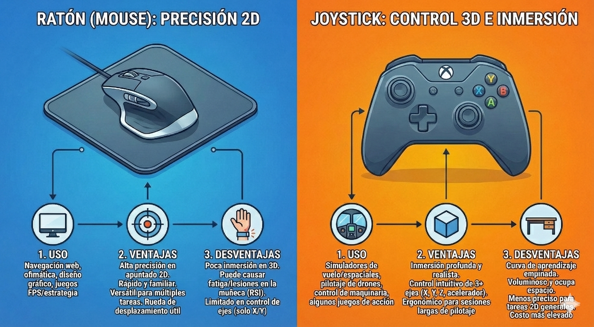

# FHW-RatonyJoystick

# 🖱️ Periféricos de Entrada: Ratones y Joysticks

Este proyecto analiza la evolución, características y tipología de dos de los dispositivos de interfaz humana (HID) más importantes en la historia de la computación.

---

## 1. Definición del periférico

### El Ratón (Mouse)
Dispositivo apuntador utilizado para facilitar el manejo de un entorno gráfico en una computadora. Generalmente fabricado en plástico, se utiliza con una de las manos y detecta su movimiento relativo en dos dimensiones por la superficie plana en la que se apoya.

### El Joystick (Palanca de mando)
Dispositivo de control que consiste en una palanca que gira sobre una base e informa su ángulo o dirección al dispositivo que está controlando. Es fundamental en la simulación de vuelo y control de maquinaria.

---

## 2. Características principales

### 🖱️ Ratón
* **Conectividad:** Cableado (USB) o Inalámbrico (RF/Bluetooth).
* **Sensor:** Óptico (LED) o Láser. Se mide en **DPI** (Puntos por pulgada).
* **Interfaz:** Mínimo de dos botones y una rueda de desplazamiento (Scroll).

### 🕹️ Joystick
* **Ejes:** Control de X (Alabeo), Y (Cabeceo) y a menudo Z (Guiñada/Rotación).
* **Retorno:** Sistema de muelles para el autocentrado de la palanca.
* **Gatillos:** Botones de disparo rápido y setas de control de vista (Hat-switch).

---

## 3. Tipos

### Tipos de Ratones
1.  **Mecánicos:** Tecnología antigua de bola y rodillos.
2.  **Ópticos:** Usan luz LED/Infrarroja. No funcionan bien en superficies brillantes.
3.  **Láser:** Alta precisión, funcionan en cristal.
4.  **Ergonómicos/Verticales:** Cambian la postura de la mano para evitar el túnel carpiano.
5.  **Trackball:** La bola está en la parte superior y se mueve con el dedo.

### Tipos de Joysticks
1.  **Digitales (Arcade):** Interruptores simples (On/Off). 8 direcciones básicas.
2.  **Analógicos:** Usan potenciómetros para medir la intensidad del movimiento.
3.  **HOTAS:** "Hands On Throttle-And-Stick". Separa la palanca del acelerador (Simulación de vuelo).
4.  **Sensores Hall:** Usan magnetismo en lugar de contacto físico para evitar desgaste.

---

## 4. Ejemplos comerciales

| Dispositivo | Modelo | Descripción y Características |
| :--- | :--- | :--- |
| **Ratón** | **Logitech MX Master 3S** | Referente en productividad. Cuenta con un sensor de **8000 DPI** que funciona sobre vidrio y una rueda de desplazamiento electromagnética *MagSpeed*. Diseño ergonómico para la palma derecha. |
| **Joystick** | **Thrustmaster T.16000M** | Referente en simulación. Destaca por usar tecnología **H.E.A.R.T** (sensores magnéticos Hall) que garantiza una precisión 256 veces mayor que los sistemas estándar y elimina el "drift" por fricción. |

---

## 5. Conclusiones

Los dispositivos de interfaz humana han evolucionado drásticamente. Mientras que el **ratón** se ha consolidado como la herramienta estándar insustituible para la navegación precisa en interfaces 2D y productividad general, el **joystick** se ha especializado en el control de movimiento tridimensional, dominando nichos específicos como la simulación de vuelo, el pilotaje de drones y el control de maquinaria industrial pesada.

---

## Referencias, Licencia y Autores

### 📚 Referencias
* Norton, P. (2006). *Introducción a la computación*. McGraw-Hill Interamericana.
* Logitech.com. (2023). *Historia del ratón de ordenador*.
* Thrustmaster Technical Support. *Funcionamiento de sensores Hall y H.E.A.R.T*.

### 📄 Licencia
Este proyecto está bajo la Licencia **Creative Commons Reconocimiento-NoComercial (CC BY-NC)**.

### ✍️ Autores
* **Manuel Morales Ca** - *Investigación y Redacción*
* **Grupo:** 1 ASIR
* **Fecha:** Enero 2026
